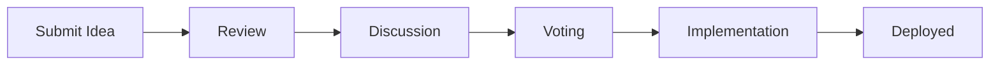

# Submit an Innovation Idea

Have a great idea to improve our projects, processes, or tools? We want to hear it! This guide explains how to submit and track your innovation proposals.

## How It Works



## Submission Guidelines

### What Makes a Good Idea?

- **Clear Problem Statement** - What problem does this solve?
- **Proposed Solution** - How would you approach it?
- **Impact Assessment** - Who benefits and how?
- **Feasibility** - Is it technically achievable?

### Idea Categories

| Category | Description | Examples |
|----------|-------------|----------|
| **Process** | Workflow improvements | Code review automation, deployment pipelines |
| **Tooling** | Developer tools | IDE plugins, CLI utilities |
| **Architecture** | System design | Microservices patterns, caching strategies |
| **Quality** | Code quality | Testing frameworks, monitoring |
| **Culture** | Team practices | Knowledge sharing, mentoring |

## How to Submit

### Step 1: Check Existing Ideas

Before submitting, search existing proposals to avoid duplicates.

### Step 2: Create Your Proposal

Use this template:

```markdown
## Idea Title

### Problem
Describe the current pain point or opportunity.

### Proposed Solution
Explain your idea in detail.

### Benefits
- Benefit 1
- Benefit 2
- Benefit 3

### Considerations
- Technical requirements
- Resource needs
- Potential challenges

### Success Metrics
How will we measure if this is successful?
```

### Step 3: Submit for Review

1. Create a new discussion in the Innovation category
2. Tag relevant stakeholders
3. Be responsive to feedback

## Idea Lifecycle

### Status Definitions

- **Draft** - Initial submission, being refined
- **Under Review** - Being evaluated by the team
- **Approved** - Accepted for implementation
- **In Progress** - Currently being built
- **Completed** - Successfully implemented
- **Archived** - Not proceeding (with explanation)

## Current Initiatives

### Active Ideas

1. **Automated Code Review Bot** - AI-powered PR review assistant
2. **Internal Component Library** - Shared UI components
3. **Developer Onboarding Portal** - Interactive learning platform

### Recently Implemented

- Centralized logging dashboard
- Automated dependency updates
- Standardized project templates

## Recognition

Contributors whose ideas are implemented receive:

- Recognition in company communications
- Innovation badge on profile
- Opportunity to lead implementation

---

*Have questions? Reach out to the Innovation Committee.*
